### Java Day Tokyo 2016

「コンテナとJavaとOracle JET<br>によるアプリ開発ハッカソン」<br>ガイドブック
================================================================

<br>

## 目次

1. 前提条件
2. デモアプリの作りを理解する
3. デモアプリをローカルで動かす
4. デモアプリを編集する
5. Oracle Application Container Cloudにデプロイする
6. Appendix


<div style="page-break-before:always"></div>

## 1. 前提条件

このハッカソンでは、事前に以下のソフトウェアのインストールをお願いしております。インストールが完了していない場合、講師までその旨お知らせください。

- Java SE Development Kit(JDK) 8
- Maven 3.x 以上
- 以下のいずれかのWebブラウザ
    * Google Chrome
    * Mozilla Firefox
    * Safari
    * Microsoft Edge

また、本ガイドブックの記載内容、及び講師から差し上げる解説では、以下の環境を利用いただくことを想定しています。

- プラットフォーム
    * Windows 7 Professional (x64)
- コマンドライン I/F
    * Windows コマンドプロンプト（Mavenによるビルドやアプリケーションの起動の際に利用）
- Webブラウザ
    * Google Chrome
- IDE
    * Eclipse 4.5 MARS

お持ちいただいているPCの環境がこれと異なる場合、ご自身で手順を読み替えていただく場合があります。あらかじめご了承ください。


<div style="page-break-before:always"></div>

## 2. デモアプリのつくりを理解する
ここでは、デモアプリの機能、及びアーキテクチャについて解説します。


### 2-1. 概要
本ハッカソンで利用するデモアプリは、人事システムのデータを模した、HR(Human Resource)サンプルスキーマのデータを、ブラウザの画面に表示するアプリケーションです。

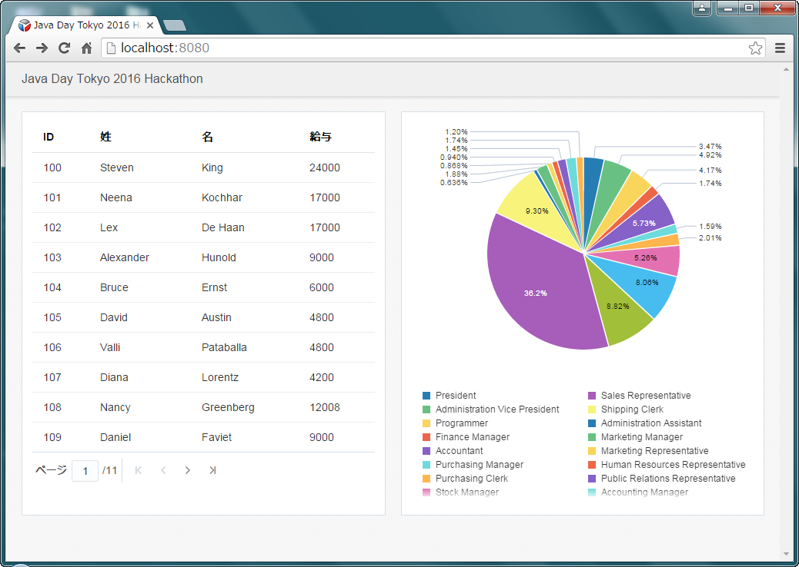

画面左の表では、各従業員のデータをリストにして表示します。一方、画面右の円グラフでは、職種毎の給与の合計額を、パーセンテージで表示します。

サーバーサイドでは、従業員のデータの一覧を返すREST APIを、Javaで実装しています。
クライアントサイドでは、上記REST APIの呼出しと、取得したデータの加工／表示をhtml/JavaScriptで実装しています。


### 2-2. サーバーサイド
以下の図は、サーバーサイドの構成を表しています。

<div align="center">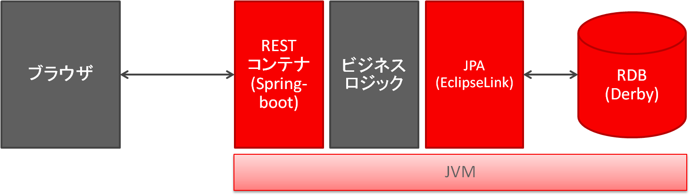</div>

本アプリケーションは、以下のOSS群を使って実装されています。

- REST APIコンテナ
    * Spring-Boot
- O/Rマッパー
    * EclipseLink
- リレーショナルデータベース
    * Derby

Spring-Bootは組み込み型のTomcatを利用して稼働（デフォルトの場合）する、RESTサービスのJavaフレームワークです。
クライアントから受けたAPI呼出しをビジネスロジックに引き継ぐ、ビジネスロジックからの返り値をクライアントに返却する、という役割を持ちます。

ビジネスロジック部分では、RDBに接続してHRスキーマのデータを取得します。この動作には、JPA（Java EEのO/Rマッパーの仕様）の実装の1つである、EclipseLinkを利用します。

DerbyデータベースはJavaで実装されたRDBで、本アプリケーションでは読み取り専用の組み込みモードで動作させています。

以上の全ての実装は、ビルドで作成された単ーのjarファイルに格納されており、1つのJVM上で動作します。

次に引用するコードは、本アプリケーションのビジネスロジック部分のコードです。

```java
01:  @RequestMapping(path = "/employees",
02:               method = RequestMethod.GET)
03:  public List<Employee> getEmployees() {
04:      EntityManager em = EntityManagerUtils.getEntityManager();
05:      @SuppressWarnings("unchecked")
06:      List<Employee> entities =
07:          em.createNamedQuery("Employee.findAll").getResultList();
08:      // コメントアウト部分は省略
09:      return entities;
10:  }
```

- 4-7行目
    * JPAのNamedQueryを利用して、全てのEmployeeテーブルのエンティティ取得しています。組み込みのDerbyデータベースを利用していますが、コードの記述内容は、通常のJPAと変わりません。

- 9行目
    * このメソッドの返り値として、エンティティのListを返却しています。このようにPOJOのリストを返却すると、Spring-Bootの機能により、JSONの配列に変換してクライアントへのレスポンスが返されます。


### 2-3. クライアントサイド
今回のハンズオンでは、クライアント・サイドの実装に Oracle JET (Oracle JavaScript Extension Toolkit) を使用します。<br>
Oracle JETは、HTML5/JavaScript/CSSをベースとしたフロントエンド開発を簡素化するためにオラクルが開発を進めているオープンソース・プロジェクトで、Universal Permissive License 1.0 (UPL 1.0) で誰でも利用できます。

Oracle JET は、jQuery や Knockout.js、RequrieJS などの現在既に広く利用されているオープンソースの JavaScript ライブラリに加えて、オラクルが開発した RESTful サービス呼び出しを簡素化するデータ・モデルの API (Common Model & Collection API) や、チャートやゲージなどのデータを可視化するためのUIコンポーネントなどを提供しています。

今回のデモ・アプリケーションのクライアント・サイドは、次の図のように Model/View/ViewModel パターンに基づいて実装されています。

<div align="center">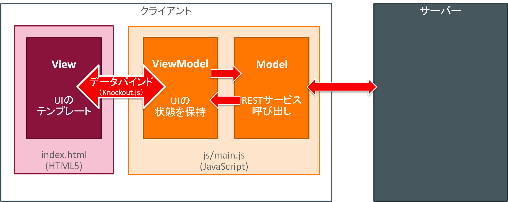</div>

- Model
    * RESTサービス呼び出しなどのビジネス・ロジックを実装します。Oracle JET は REST サービスの呼び出しを共通化するための Common Model & Collection API を提供しているので、データの CRUD を簡単に実装できます。
- View
    * UI のテンプレートです。Oracle JETでは HTML5 (\*.html) で記述します。
- ViewModel
    * UI の状態を保持するオブジェクトです。Oracle JET は Knockout.js を利用することで、View と ViewModel の間の双方向のデータバインドを簡単に実現できます。

ここでは、サンプル・アプリケーションの View を中心に説明します。今回使用するサンプル・アプリケーションは、REST サービスから取得したデータを画面左にテーブルで、画面右に職種別の給与データの合計を円グラフで表示します。テーブルと円グラフは、それぞれ Oracle JET が提供する UI コンポーネントを使用しています。


画面左に表示されるテーブルには、「ID」、「姓」、「名」、「給与」の4つの列があります。次のコードは、View のソースコードからテーブルの設定に関する部分を抜粋したものです。

```
01: <table summary="従業員一覧を表示" aria-label="従業員一覧を表示"
02:   data-bind="ojComponent: { component: 'ojTable',
03:     data: tableDataSource,
04:     columns: [
05:       { headerText: 'ID'   },
06:       { headerText: '姓'   },
07:       { headerText: '名'   },
08:       { headerText: '給与' },
09:     ],
10:     rowTemplate: 'empRowTemplate'
12:   }">
13: </table>
14: <script id="empRowTemplate" type="text/html">
15:   <tr>
16:     <td data-bind="text: employeeId"></td>
17:     <td data-bind="text: firstName"></td>
18:     <td data-bind="text: lastName"></td>
19:     <td data-bind="text: salary"></td>
20:   </tr>
21: </script>
```

- 2行目
    * Oracle JET が提供する UI コンポーネントを使用する場合は、`data-bind="ojComponent: { ... }"` という形式でコンポーネントを設定できます。`component: 'ojTable'` は、使用するコンポーネントを指定しています。
- 3行目
    * `data: tableDataSource` が、テーブルに表示するデータを指定しています。`tableDataSource` は、ViewModel に定義されたプロパティです。
- 4 - 9行目
    * テーブルの列を指定しています。
- 10行目
    * `rowTemplate: 'empRowTemplate'` は、テーブルの行のテンプレートの名前を指定しています。テンプレート `empRowTemplate` は、14 - 21行目で定義されています。例えば、16行目を変更すると、ID を表示するセルの書式などを変更できます。

次のコードは、View のソースコードから円グラフの設定に関する部分を抜粋したものです。

```
01: <div style="width: 100%; height: 500px;"
02:   data-bind="ojComponent: {
03:     component: 'ojChart',
04:     type: 'pie',
05:     series: chartSeries,
06:     legend: { position: 'bottom' }
07:   }">
08: </div>
```

- 3行目
    * テーブルの時と同様に、設定するコンポーネントを指定しています。
- 4行目
    * 「type: 'pie'」 は、グラフの種類（円グラフ）を表しています。ojChart コンポーネントの `type` には他にも、bar（棒グラフ）や line（折れ線グラフ）などが指定できます。
- 5行目
    * 「series: chartSeries」は、グラフに表示するデータの系列を指定しています。テーブルの時と同様に、chartSeries も ViewModel に定義されているプロパティです。
- 6行目
    * 「legend: { position: 'bottom' }」で、凡例がグラフの下に表示されるように設定しています。

Oracle JET が提供する UI コンポーネントは、今回のサンプルで使用している他にもさまざまな設定が可能です。Oracle JET では Cookbook を提供しており、HTML や JavaScript のコードを実際に編集しながらコンポーネントの見た目や動作を確認することができます。

- [Oracle JET Cookbook](http://www.oracle.com/webfolder/technetwork/jet/uiComponents-formControls.html)
    * http://www.oracle.com/webfolder/technetwork/jet/uiComponents-formControls.html

例えば、今回のサンプル・アプリケーションで使用している円グラフの Cookbook は、次の URL でアクセスできます。

- http://www.oracle.com/webfolder/technetwork/jet/uiComponents-pieChart-default.html

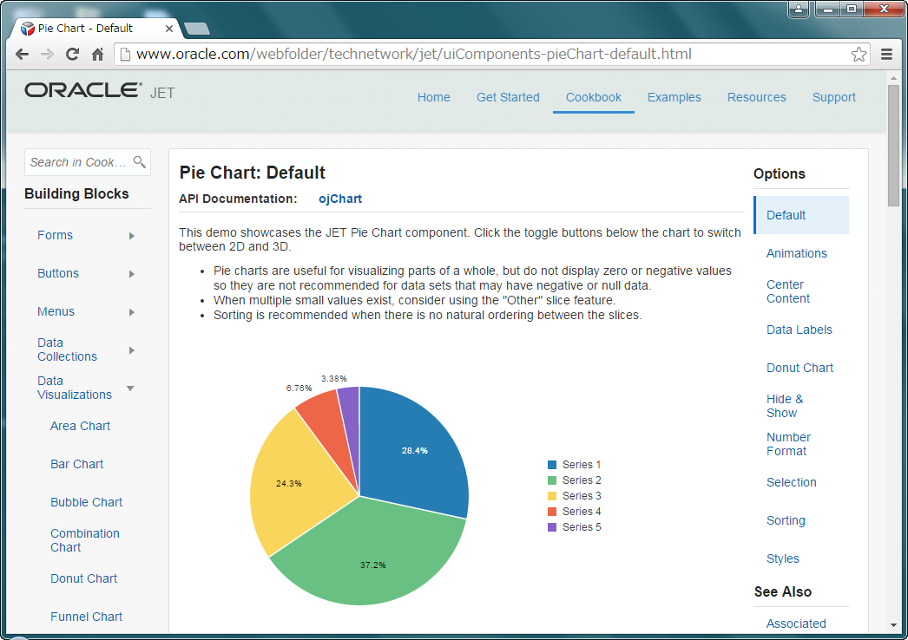

「Recipe」のセクションでは円グラフを使用するための基本的な設定について説明しています。例えば、`styleDefaults.threeDEffect` というプロパティの値を `on` に設定すると3Dで表示されることなどがわかります。

「HTML Editor」と「JavaScript Editor」は、画面上部に表示されている円グラフのソースコードです。それぞれ編集し、`Apply Changes`をクリックすると適用されます。


<div style="page-break-before:always"></div>
## 3. デモアプリをローカルで動かす
<!-- ここからは参加者の作業 説明なし -->
ここでは、デモアプリのソースコードビルドして、ご自身のローカル環境で動作させるまでの手順をガイドします。


### 3-1. ソースコードをダウンロードする
まず、GitHubから、アプリケーションのソースコードを取得します。

ブラウザを起動して、以下のURLにアクセスします。

- [https://github.com/JDT2016-Hackathon/hr]("https://github.com/JDT2016-Hackathon/hr")


リポジトリ「JDT2016-Hackathon/hr」のトップ画面が表示されたら、`Clone or Download` > `Download ZIP`をクリックします。

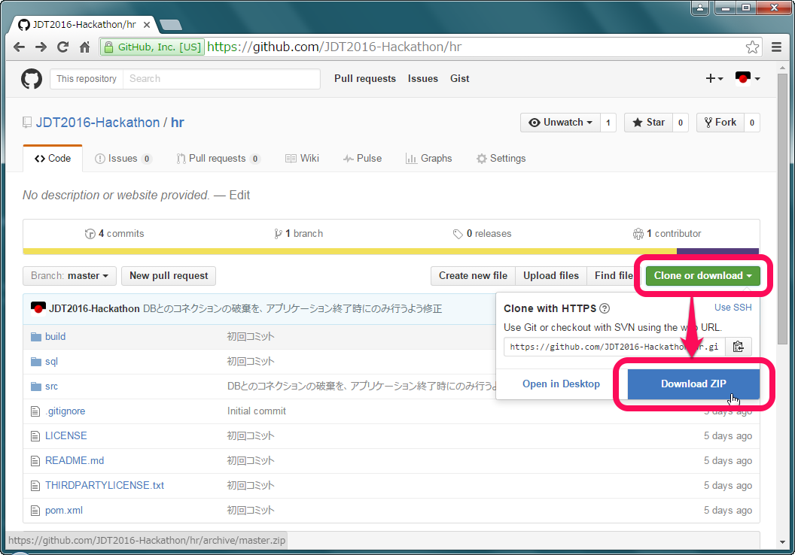

hr-master.zipのダウンロードが開始されます。お使いのブラウザに合わせて、ダウンロードを進める操作をおこなってください。

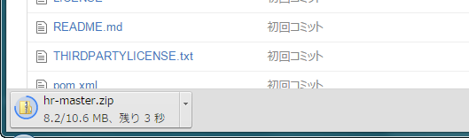

ダウンロードが完了したら、取得したファイルhr-master.zipを解凍します。生成されたフォルダhr-masterをエクスプローラで開くと、同名のフォルダが格納されていますので、これを任意のフォルダに移動してください。

（以降、上記移動後のhr-masterのパスを、[hr-master]と記載します。）


### 3-2. ソースコードをビルドする
コマンドプロンプトを起動し、カレント・ディレクトリを[hr-master]に変更します。

    > cd [hr-master]

カレント・ディレクトリのファイルを一覧表示し、以下のようなファイル／フォルダ群があることを確認します。

    > dir
     …
     C:\Users\hhayakaw\Desktop\hr-master\hr-master のディレクトリ

    2016/05/13  15:40    <DIR>          .
    2016/05/13  15:40    <DIR>          ..
    2016/05/13  15:40               170 .gitignore
    2016/05/13  15:40    <DIR>          build
    2016/05/13  15:40            11,357 LICENSE
    2016/05/13  15:40             3,006 pom.xml
    2016/05/13  15:40               104 README.md
    2016/05/13  15:40    <DIR>          sql
    2016/05/13  15:40    <DIR>          src
    2016/05/13  15:40            13,359 THIRDPARTYLICENSE.txt
                   5 個のファイル              27,996 バイト
                   5 個のディレクトリ  53,948,284,928 バイトの空き領域

次に、Mavenを使ってソースコードをビルドします。以下のコマンドを実行してください。

    > mvn package

ビルドの実行中に多数のメッセージが出力されますが、最終的に、以下のように"build success"のメッセージが表示されれば、ビルドは成功です。

    [INFO] ------------------------------------------------------------------------
    [INFO] BUILD SUCCESS
    [INFO] ------------------------------------------------------------------------
    [INFO] Total time: 8.332 s
    [INFO] Finished at: 2016-05-13T16:22:21+09:00
    [INFO] Final Memory: 31M/330M
    [INFO] ------------------------------------------------------------------------

ビルドが成功すると、[hr-master]/target/ フォルダ配下に成果物が作成されます。hr-0.1.jar及びhr-0.1-acc.zipという名前のファイルがあることを確認してください。

    > dir target
    …
     C:\Users\hhayakaw\Desktop\hr-master\hr-master\target のディレクトリ

    2016/05/13  16:22    <DIR>          .
    2016/05/13  16:22    <DIR>          ..
    2016/05/13  16:22    <DIR>          archive-tmp
    2016/05/13  16:22    <DIR>          classes
    2016/05/13  16:22    <DIR>          generated-sources
    2016/05/13  16:22        25,808,692 hr-0.1-acc.zip
    2016/05/13  16:22        25,808,321 hr-0.1.jar
    2016/05/13  16:22           176,995 hr-0.1.jar.original
    2016/05/13  16:22    <DIR>          maven-archiver
    2016/05/13  16:22    <DIR>          maven-status
    2016/05/13  16:22    <DIR>          test-classes
                   3 個のファイル          51,794,008 バイト
                   8 個のディレクトリ  53,884,403,712 バイトの空き領域

hr-0.1.jarは、このアプリケーションの本体、hr-0.1-acc.zipは、Application Container Cloudにデプロイするため、アプリケーションにメタデータを追加した形式のアーカイブです。

以上で、ソースコードのビルドは完了です。


### 3-3. 動かしてみる
アプリケーションの動作確認をおこないます。

ビルドしたアプリケーションを起動します。2. で起動したコマンドプロンプトで、以下のコマンドを実行してください。

    > java -jar target/hr-0.1.jar

以下のように、"Welcome to Java Day Tokyo 2016!"のメッセージが表示されれば、アプリケーションは正常に起動しています。

    [EL Info]: connection: 2016-05-16 16:27:20.363--ServerSession(256577194)--/file:/C:/Users/hhayakaw/Documents/GitHub/hr/target/hr-0.1.jar_HR login successful
    Welcome to Java Day Tokyo 2016!

次に、Webブラウザで以下のURLにアクセスします。

- [http://localhost:8080/](http://localhost:8080)

以下のような画面が表示されることを確認してください。


デモアプリをローカルで動作させる手順は、以上です。


<div style="page-break-before:always"></div>
## 4. デモアプリをカスタマイズする
ここでは、ハッカソンパートの準備として、アプリケーションのカスタマイズの一例を実践してみます。


### 4-1. IDEにコード群をインポートする
ダウンロードしたコード群をIDE（本ガイドでは、Eclipseを使用）にインポートします。

Eclipseを起動したら、ツールバーから`File` > `Import...`の順にクリックします。

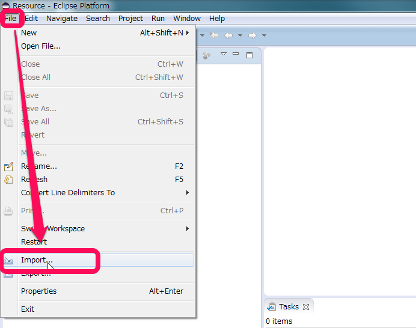

「Import」ダイアログが開いたら、「Select an import source: 」というテキストボックスに"maven"と入力します。「Existing Maven Projects」という項目が表示されるので、それを選択し、`Next`をクリックします。

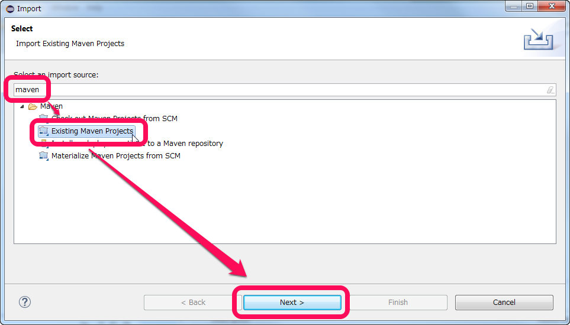


続く画面で、`Browse...`をクリックします。ディレクトリを選択するダイアログが表示されるので、展開したソースコードのルートフォルダ [hr-master] を選択します。

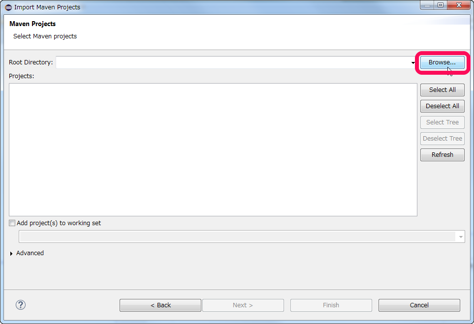

「Root Directory: 」、「Projects: 」の表示が、下図のようになっていることを確認し、`Finish`をクリックします。

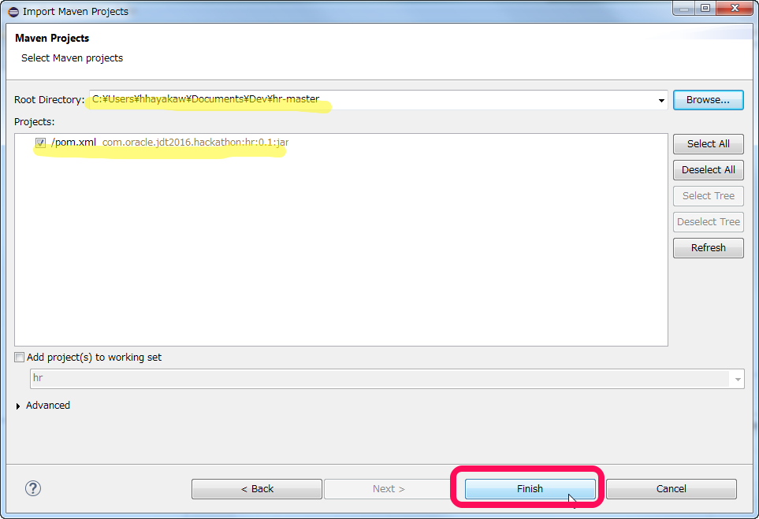

インポート処理が完了すると、EclipseのProject Explorerに「hr」というプロジェクトが表示されます。

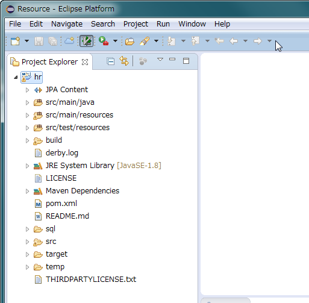

以上で、IDEへのプロジェクトのインポートは完了です。これ以降、ソースコードのカスタマイズを進めていきます。


### 4-2. サーバーのビジネスロジックを編集する
ここでは、サーバーが返すJSONの配列にエントリーを1つ追加して、グラフの表示を変更してみます。

編集対象のファイルはHrResourceController.javaです。このファイルは以下のパスに格納されています。

- [hr-master]\src\main\java\com\oracle\jdt2016\hackathon\hr\HrResourceController.java

HrResourceController.javaの抜粋を以下に示します。

```java
32:  @RequestMapping(path = "/employees",
33:                  method = RequestMethod.GET)
34:  public List<Employee> getEmployees() {
35:      EntityManager em = EntityManagerUtils.getEntityManager();
36:      @SuppressWarnings("unchecked")
37:      List<Employee> entities =
38:          em.createNamedQuery("Employee.findAll").getResultList();
39:      /*
40:       * 以下のコードのコメントアウトを解除すると、返り値に新しい
41:       * エントリーが追加されるようになります。
42:       * これにより、画面に表示されるグラフの形状が変わることを確認
43:       * してください。
44:       */
45://      Employee rookie = new Employee();
46://      rookie.setEmployeeId(999);
47://      rookie.setFirstName("Duke");
48://      rookie.setLastName("Java");
49://      rookie.setSalary(BigDecimal.valueOf(99999999));
50://      @SuppressWarnings("unchecked")
51://      List<Job> jobs =
52://          em.createNamedQuery("Job.findAll").getResultList();
53://      rookie.setJob(jobs.get(0));
54://      entities.add(rookie);
55:      return entities;
56:  }
```

45-54行目のコメントアウトを解除してください。このコードでは、返り値となるEmployeeオブジェクトのListに、新たな要素を追加します。

コードを編集したら、アプリケーションを再ビルドします。<br>
まず、現在稼働中のサンプルアプリケーションを一度停止します。アプリケーションが稼働中のコマンドプロンプトで、`Ctrl+C`を入力します。

プロンプトの入力の受付状態が帰ってきたら、以下のようにコマンドを実行します。

    > mvn clean package

これまでにビルドした成果物が一度削除された後(clean)、ビルドが開始されます。この場合も、"build success"のメッセージ表示されれば、ビルド成功です。

続いて、3. の手順と同様にアプリケーションの起動をおこない、Webブラウザで再度アプリケーションのURLにアクセスします。

以下の画像のようにグラフの表示が変わっていることを確認してください。

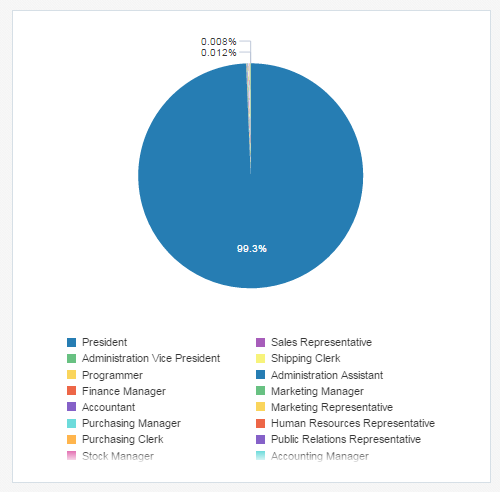


### 4-3. index.html ファイルを編集する
ここでは、次のように円グラフの設定を追加してみます。

- 3D で表示
    * プロパティ `styleDefaults.threeDEffect` の値を `on` に設定します。styleDefaults は JavaScript オブジェクトとして定義されているので、`styleDefaults: { treeDEffect: 'on' }` のような形式で指定する必要があります。
    * [Oracle JET Cookbook: Pie Chart - Default](http://www.oracle.com/webfolder/technetwork/jet/uiComponents-pieChart-default.html)
- データが変更されたときにアニメーション効果を追加
    * プロパティ `animationOnDataChange` の値を `auto` に設定します。
    * [Oracle JET Cookbook: Pie Chart - Animations](http://www.oracle.com/webfolder/technetwork/jet/uiComponents-pieChart-animation.html)

編集対象のファイルは、index.htmlです。index.htmlは以下のパスに格納されています。

- [hr-master]\src\main\resources\static\index.html

index.html の `ojChart` コンポーネントの設定のソース（68 - 75行目）は、次のように変更します。

_変更前:_

```
68: <div style="width: 100%; height: 500px;"
69:   data-bind="ojComponent: {
70:     component: 'ojChart',
71:     type: 'pie',
72:     series: chartSeries,
73:     legend: { position: 'bottom' },
74:   }">
75: </div>
 ```

_変更後 （74および75行目を追加）:_

```
68: <div style="width: 100%; height: 500px;"
69:   data-bind="ojComponent: {
70:     component: 'ojChart',
71:     type: 'pie',
72:     series: chartSeries,
74:     styleDefaults: { threeDEffect: 'on' },
75:     animationOnDataChange: 'auto',
73:     legend: { position: 'bottom' }
76:   }">
77: </div>
```

アプリケーションを再ビルドし、実行すると円グラフは次のように表示されます。

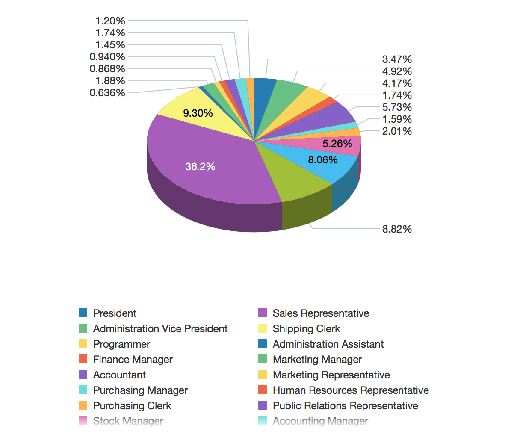

<i>
<strong>[NOTE]</strong><br>
以上は、View(\*.html)の編集によるカスタマイズの例ですが、Viewにバインドするデータのカスタマイズを行う場合、ViewModel(main.js)の編集が必要です。
ViewModelについて理解するには、6. Appendixを参照してください。
</i>


<div style="page-break-before:always"></div>
## 5. Oracle Application Container Cloudにデプロイする
Oracle Application Contaier Cloud（以下、ACC）は、Dockerベースの軽量アプリケーションコンテナを提供するPaaSサービスです。

ここでは、3. で作成したアプリケーションを、ACCにデプロイして稼働させる手順を解説します。


### 5-1. ACCのアプリケーション・アーカイブについて
ACCにアプリケーションをデプロイするには、アプリケーションのjarファイルにメタデータファイルを加えた、zipファイルを作成します。

本ハッカソンのデモアプリでは、Mavenの機能[^1]を利用することにより、ビルド時に自動的にこのファイルが作成されるように構成されています。ファイル名はhr-0.1-acc.zipです。

hr-0.1-acc.zipには、以下のような構成でファイルが格納されています。

    hr-0.1-acc.zip
    ├── hr-0.1.jar
    └── manifest.json

manifest.jsonが、ACCのメタデータファイルです。デモアプリのmanifest.jsonの記述内容を以下に引用します。

```js
  {
    "runtime": {
      "majorVersion": "8"
    },
    "command": "java -jar hr-0.1.jar",
    "release": {
      "commit": "verion 0.1 .",
      "version": "0.1"
    },
    "notes": "Human Resource Service"
  }
```

このメタデータファイルで特に重要なのは、`runtime`と`command`の2つの要素です。

- runtime 要素
    * 実行環境のバージョン情報を指定します。上記の例では、java 8を指定しています。
- command 要素
    * 実行環境上でアプリケーションのプロセスを開始する際の、コマンドを指定します。本デモアプリをローカルで起動するのと同様、アプリケーションのjar指定してjavaコマンドを実行するよう、コマンドを記述しています。

以降の手順では、hr-0.1-acc.zipをACCにアップロード／デプロイしていきます。

<i>
[^1]<br>
より正確には、maven-assembly-pluginというMavenプラグインを利用して、hr-0.1.jarとmanifest.jsonをzipアーカイブにまとめています。
詳細はソースコード中の[hr-master]\pom.xml及び[hr-master]\build\assembly\descriptor.xmlを参照ください。
</i>


### 5-2. ACCのコンソールにアクセスする
<!-- 3. でビルドまでできている前提 -->
ブラウザで以下のURLにアクセスします。

    https://cloud.oracle.com/

Oracle Cloudのホーム画面が表示されたら、画面右上の[Sign In]をクリックします。

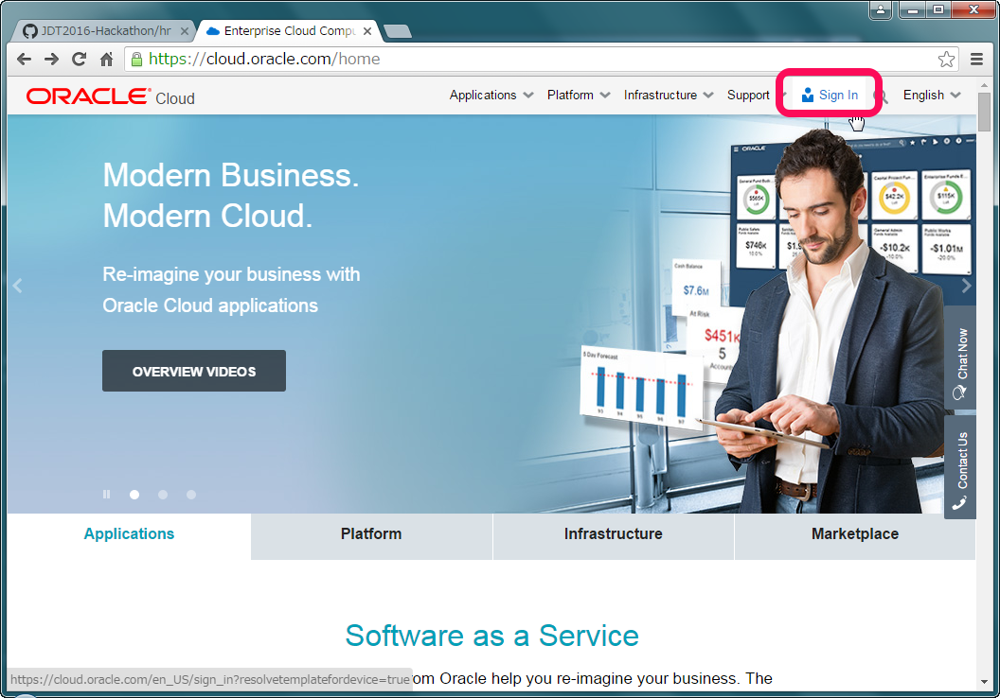

「Cloud Account」と表記された領域にあるプルダウンメニューで、講師から指示されたデータセンターを選択し、`My Service`ボタンをクリックします。

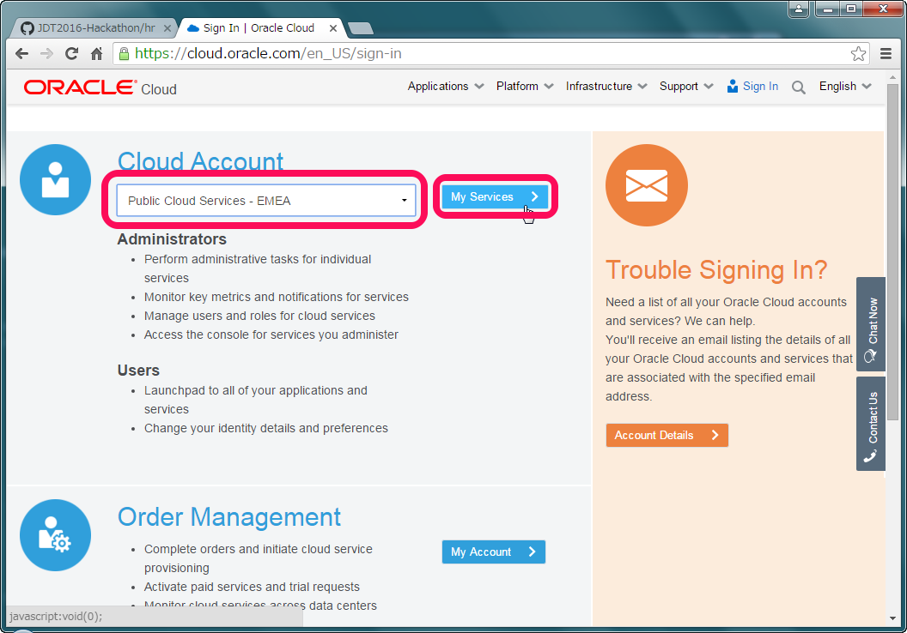

サインイン画面が表示されたら、講師から指示されたアイデンティティ・ドメインを入力し`実行`をクリックします。

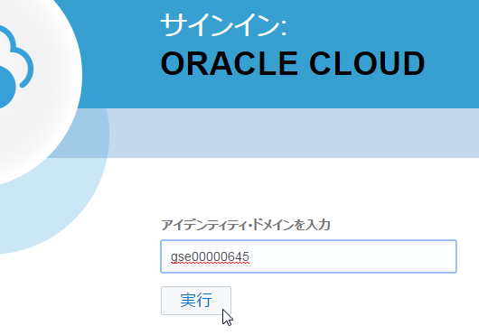

テキストボックスがユーザー名とパスワードの入力欄に切り替わります。こちらも講師から指示された値を入力し、`サインイン`をクリックします。

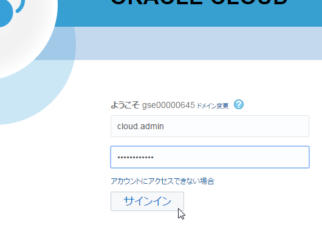

My Service画面が表示されたら、画面左上のナビゲーション・メニュー アイコンをクリックします。

展開されたメニューで、`Dashboard` > `Oracle Application Container Cloud`ををクリックします。

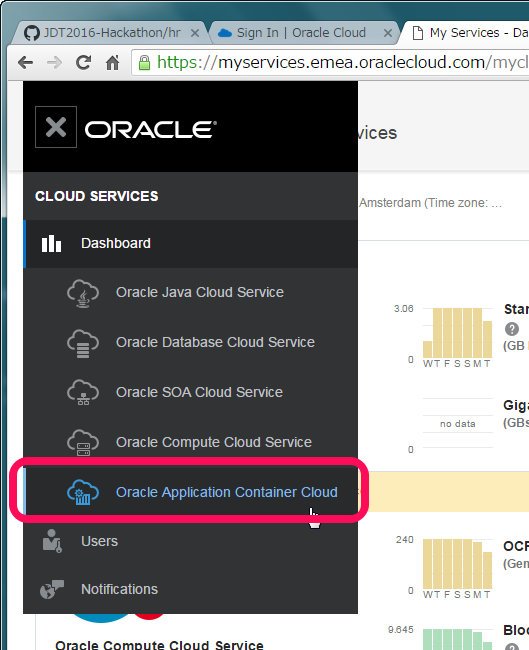

以下のような、ACCの管理コンソールのトップ画面が表示されることを確認してください。

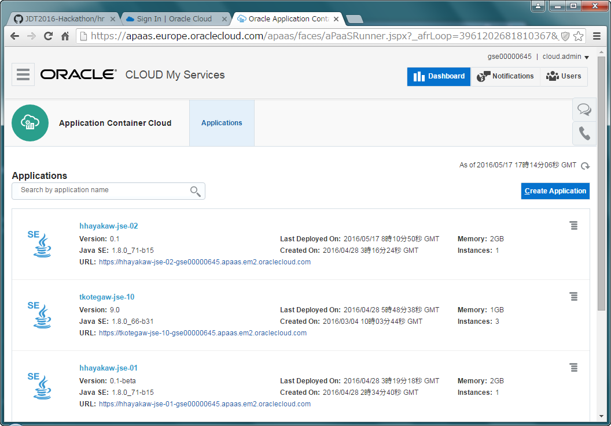

### 5-3. アプリケーションのデプロイ
管理コンソールのトップ画面では、既に作成されているアプリケーションが表示されています。今回は、このアプリケーションを更新する形で、アプリケーションデプロイします。

アプリケーションの名前部分のリンクをクリックします。

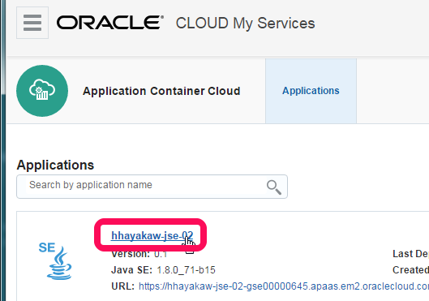

選択したアプリケーションの管理画面が表示されたら、画面左の`Deployment`パネルをクリックします。

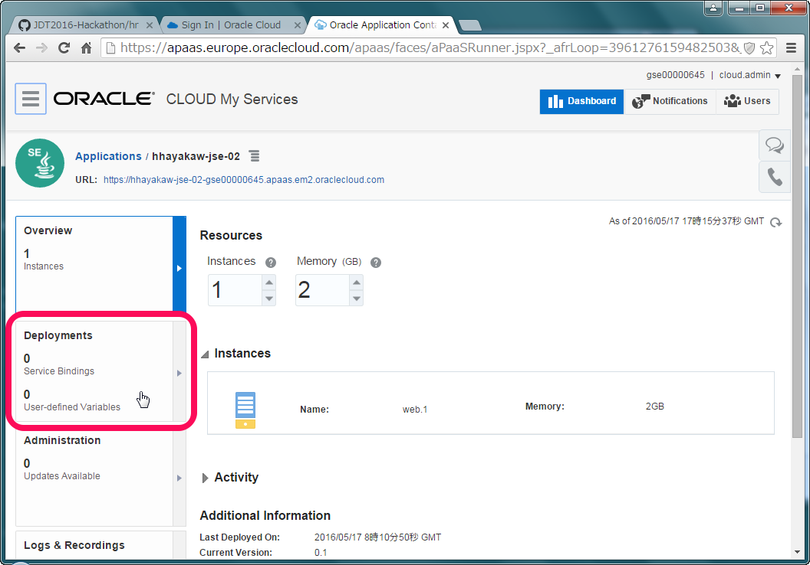

画面中央の領域が「Deployments」というタイトルの表示内容に切り替わったら、右上の`Upload New`をクリックします。

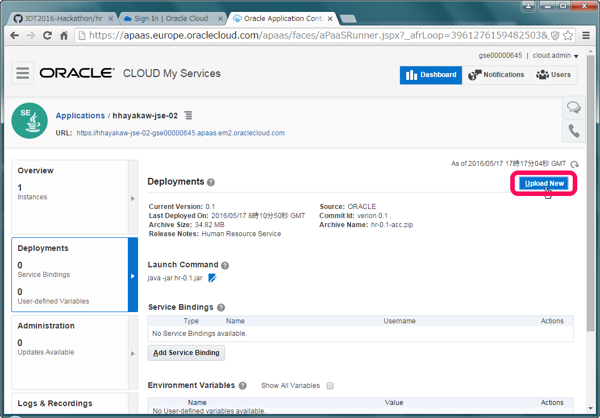

「Upload」ダイアログが表示されたら、ラジオボタンで`Upload application archive`を選択します。続けて、`ファイルを選択`をクリックし[hr-master]\target\hr-0.1-acc.zipを選択します。

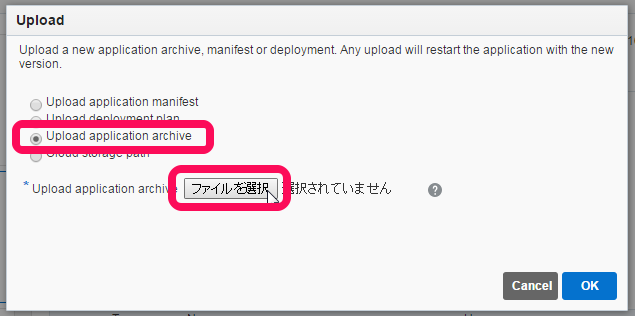

最後に「Upload」ダイアログの`OK`ボタンをクリックします。

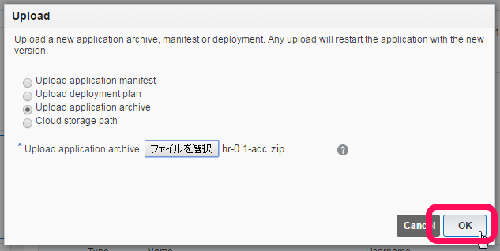

ファイルのアップロード処理の後「Upload」ダイアログが自動的に閉じます。<br>
管理コンソール画面を見ると左上のアイコンに砂時計のマークが付きます。これはデプロイ処理中であることを表しています。

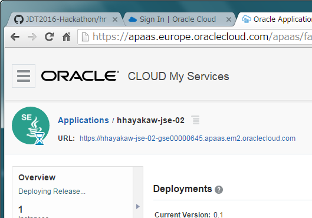

数分程度経過してから画面右のリフレッシュアイコンをクリックすると、デプロイ処理が完了し、砂時計のマークが消えていることが確認できます。

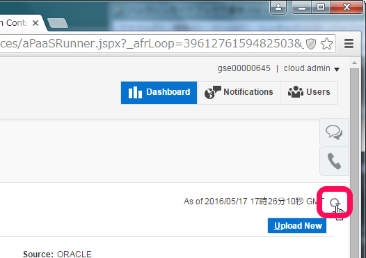

### 5-4. 動作確認
デプロイが終わったアプリケーションにアクセスするには、画面左上に表示されているリンクをクリックします。

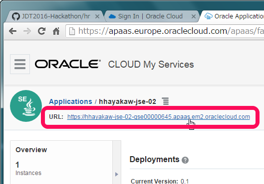

アプリケーションの画面が表示されたら、4. で行った画面の編集が反映されていることを確認してください。


<div style="page-break-before:always"></div>
## Appendix: View および ViewModel (main.js) について
ここでは、クライアント・サイドの View および ViewModel のソース main.js について解説します。
main.js では次のような内容が定義されています。

- 7-29行目
    * RequireJS のための構成情報が定義されています。RequireJS によって、アプリケーションの実行時に必要な JavaScript のライブラリが適切にロードされます。
    * RequireJS を使用する場合の HTML のソースには、`script` 要素で RequireJS のソースを読み込み、`data-bind` 属性で実際の処理を実装したスクリプトのソースを指定します。
- 30-124行目
    * RequireJS によって定義されているモジュールを利用するための `require()` 関数です。
    * `require()` 関数は次の２つの引数を指定します:
        * 最初の引数 (30-43行目): 依存しているモジュール（ライブラリ）の名前の配列
        * 2番目の引数 (44-125行目): 依存モジュールを受けて、実際の処理を実装した関数
- 46-66行目
    * 今回のサンプル・アプリケーションにおける Model にあたる部分です。
    * Oracle JET が提供している Common Model & Collctions API を使用して実装しています。
- 68-119行目
    * 今回のサンプル・アプリケーションにおける ViewModel にあたる部分です。
- 122-123行目
    * ViewModel のインスタンスを生成し、View （index.html）にバインドしています。


### Model の実装について
ここでは Model の実装について、もう少し詳しく説明します。

main.js の46-60行目は、REST サービスの employess リソースのレコードを表すオブジェクトを定義しています。

```js
  // Employee リソースのレコードを表すオブジェクトの定義
  var EmployeeModel = oj.Model.extend({
    idAttribute: "employeeId",
    parse: function (response) {
      // JSON オブジェクトから ViewModel オブジェクトで使用する形式に変換する
      return {
        employeeId: response["employeeId"],
        firstName:  response["firstName"],
        lastName:   response["lastName"],
        jobId:      response["job"]["jobId"],
        jobTitle:   response["job"]["jobTitle"],
        salary:     response["salary"]
      };
    }
  });
```

プロパティ `idAttribute` には、レコードを一意に識別できるプロパティの名前を指定しています。
parse メソッドでは、JSON オブジェクトを ViewModel で使用する形式へと変換しています。今回のサンプル・アプリケーションの REST サービスは、従業員のデータを次のような JSON 形式で返しています。

```js
  {
    "employeeId": 100,
    "commissionPct": null,
    "email": "SKING",
    "firstName": "Steven",
    "hireDate": "2003-06-17T00:00:00.000+0000",
    "lastName": "King",
    "phoneNumber": "515.123.4567",
    "salary": 24000.00,
    "job": {
        "jobId": "AD_PRES",
        "jobTitle": "President",
        "maxSalary": 40000,
        "minSalary": 20080
    },
    "employee": null,
    "jobHistories": []
  }
```

parse メソッドが定義されたことにより、ViewModel 内部では REST サービスから取得したレコードを次のような JavaScript オブジェクトとして利用できます。

```js
  {
    employeeId: 100,
    firstName: "Steven",
    lastName: "King",
    jobId: "AD_PRES",
    jobTitle: "President",
    salary: 24000.00
  }
```

<i>
<strong>[NOTE]</strong><br>
parse オブジェクトが省略された場合は、REST サービスが返す JSON オブジェクトと同じプロパティを持つ JavaScript オブジェクトとなります。
</i>

main.js の62-66行目は、EmployeeModel オブジェクトのコレクションを定義しています。

```js
  // Employee リソースのコレクション表すオブジェクトの定義
  var EmployeesCollection = oj.Collection.extend({
    url:   location.protocol + "//" + location.host + "/hr/employees",
    model: new EmployeeModel()
  });
```

プロパティ `url` で指定しているのは、REST サービスの URL です。

### ViewModel の実装について
ここでは、ViewModel に実装されている内容についてもう少し詳しく説明します。

main.js の 73-74行目は、Knockout.js によって双方向データバインドを実現しているプロパティを初期化しています。

```js
  self.titleLabel  = ko.observable("Java Day Tokyo 2016 Hackathon");
  self.employees   = ko.observableArray();
```

`ko.observable()` で初期化された ViewModel のプロパティは Knockout.js によって常に監視されており、値の変更が検出されると自動的に View に適用されます。`ko.observableArray()` も同様ですが、こちらは配列に使用されるので、要素の追加や削除などの検出が可能です。

77-86行目は、Model を使用して REST サービスを呼び出すための設定が記述されています。

```js
    self.empCollection = new EmployeesCollection();
    self.empCollection.fetch({
      success: function (collection, response, options) {
        // サービス呼び出しが成功した時の実行されるコールバック関数
        self.employees(oj.KnockoutUtils.map(collection));
      },
      error: function (jqXHR, textStatus, errorThrown) {
        oj.Logger.error("Error: " + textStatus);
      }
    });
```

`self.empCollection.fetch()` メソッドでは、REST サービス呼び出しが成功した場合とエラーが発生した場合に実行されるコールバック関数を定義しています。

main.js の 90-92行目は、View に定義されたテーブル（ojTable コンポーネント）に表示するデータを定義しています。

```js
  self.tableDataSource = ko.computed(function () {
    return new oj.PagingTableDataSource(
            new oj.ArrayTableDataSource(self.employees()));
  });
```

`ko.computed()` には、Knockout.js が監視している ViewModel のプロパティの値の変更を検出し、実行されるコールバック関数を定義しています。上のように実装されている場合、`self.employees` プロパティに値が追加または更新された場合にコールバック関数が実行されます。

main.js の 98-118行目は、View に定義された円グラフ（ojChartコンポーネント）に表示するためのデータを定義しています。`self.tableDataSource` と同様に、`self.employees` に変更があった場合に実行されるコールバック関数を指定しています。

```js
    self.chartSeries = ko.computed(function () {
      var seriesValues = [];
      if (self.employees().length !== 0) {
        var values = {};
        $.each(self.employees(), function (index, emp) {
          var jobId    = emp.jobId();
          var jobTitle = emp.jobTitle();
          var salary   = emp.salary();
          if (values[jobId]) {
            values[jobId].items[0] += salary;
          }
          else {
            values[jobId] = { name: jobTitle, items: [ salary ] };
          }
        });
        $.each(values, function (key, value) {
          seriesValues.push(value);
        });
      }
      return seriesValues;
    });
```

コールバック関数では、`jobId` ごとの `salary` の合計を算出し、グラフで表示するためのデータ形式に変換しています。今回のサンプル・アプリケーションでは、系列データの名前と値のみを指定していますが、グラフの色などのプロパティの設定も可能です。詳細は、Oracle JET の Cookbook を参照してください。
